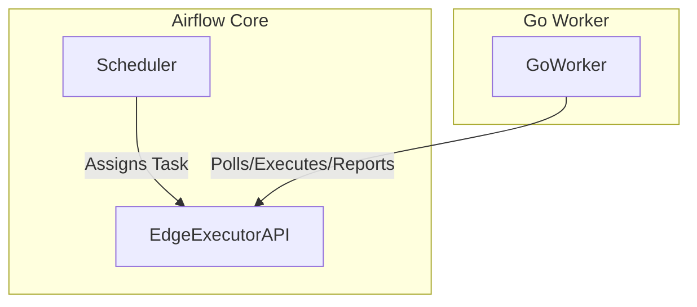

<!--
 Licensed to the Apache Software Foundation (ASF) under one
 or more contributor license agreements.  See the NOTICE file
 distributed with this work for additional information
 regarding copyright ownership.  The ASF licenses this file
 to you under the Apache License, Version 2.0 (the
 "License"); you may not use this file except in compliance
 with the License.  You may obtain a copy of the License at

   http://www.apache.org/licenses/LICENSE-2.0

 Unless required by applicable law or agreed to in writing,
 software distributed under the License is distributed on an
 "AS IS" BASIS, WITHOUT WARRANTIES OR CONDITIONS OF ANY
 KIND, either express or implied.  See the License for the
 specific language governing permissions and limitations
 under the License.
 -->

# Go SDK task execution and future plans
_Exported on 28/06/2025 at 18:01:16 GMT+5:30 from Cursor (1.1.6)_

---

**User**

The Go SDK uses the Task Execution Interface (TEI or Task API) introduced in AIP-72 with Airflow 3.0.0.

The Task API however does not provide a means to get the `ExecuteTaskWorkload` to the go worker itself. For the short term, we make use of [gopher-celery](github.com/marselester/gopher-celery) to get tasks from a Redis broker. Longer term we will likely need to stabilize the Edge Executor API and write a go client for that.

Since Go is a compiled language (putting aside projects such as [YAEGI](https://github.com/traefik/yaegi) that allow go to be interpreted) all tasks must be a) compiled in to the binary, and b) "registered" inside the worker process in order to be executed.


---

**Cursor**

Thank you for the context and summary of the Go SDK's current approach for Airflow task execution. Here's a concise breakdown and some suggestions for next steps or documentation improvements, based on your message:

### Key Points from Your Message

1. **Current State:**
   - The Go SDK interacts with Airflow 3.0.0+ via the Task Execution Interface (TEI/Task API, AIP-72).
   - The Task API does not directly deliver `ExecuteTaskWorkload` to the Go worker.
   - As a workaround, [gopher-celery](https://github.com/marselester/gopher-celery) is used to fetch tasks from a Redis broker.

2. **Future Direction:**
   - The plan is to stabilize the Edge Executor API and implement a Go client for it, removing the need for the Celery workaround.

3. **Go-Specific Constraints:**
   - Go tasks must be compiled into the worker binary.
   - Tasks must be registered in the worker process to be executable (no dynamic loading like Python).

---

### Suggestions / Next Steps

#### 1. Documentation Improvements
- **README.md**: Ensure this context is clearly stated in the Go SDK's README, especially for new contributors or users.
- **Task Registration Example**: Provide a code snippet showing how to register a task in the Go worker.
- **Celery Workaround**: Document the temporary use of gopher-celery and Redis, and the plan to migrate to the Edge Executor API.

#### 2. Codebase Improvements
- **Task Registration API**: If not already present, provide a simple API for registering tasks in the worker.
- **Edge Executor Client**: Start a design doc or stub for the future Go client for the Edge Executor API.

#### 3. Communication
- **AIP-72/Edge Executor Status**: If you're collaborating with the Airflow community, consider opening a discussion or issue about the Go SDK's needs for the Edge Executor API.

---

### Example: Task Registration in Go Worker

Here's a conceptual snippet for registering tasks in the Go worker (for documentation):

```go
package main

import (
    "github.com/apache/airflow/go-sdk/worker"
)

func MyTask(args map[string]interface{}) (interface{}, error) {
    // Task logic here
    return "result", nil
}

func main() {
    w := worker.New()
    w.Register("my_task", MyTask)
    w.Run()
}
```

---

### Would you like help with:
- Drafting or updating the README with this information?
- Adding a code example for task registration?
- Outlining a design for the Edge Executor Go client?
- Anything else related to this context?

Let me know how you'd like to proceed!

```go
package main

import (
    "github.com/apache/airflow/go-sdk/worker"
)

func MyTask(args map[string]interface{}) (interface{}, error) {
    // Task logic here
    return "result", nil
}

func main() {
    w := worker.New()
    w.Register("my_task", MyTask)
    w.Run()
}
```

---

**User**

How does edge executor fit in here?

---

**Cursor**

Great question! Here's how the Edge Executor fits into the Go SDK and the broader Airflow task execution ecosystem:

---

## 1. **What is the Edge Executor?**

The Edge Executor is a new component in Airflow (introduced as part of AIP-72 and Airflow 3.0+) designed to allow external, non-Python workers (like those written in Go, Java, etc.) to execute Airflow tasks. It provides a standardized, language-agnostic API for task execution, decoupling task execution from the Python-based Airflow core.

- **Purpose:** Allow Airflow to delegate task execution to "edge" workers written in any language, not just Python.
- **API:** Typically exposes a gRPC or HTTP API for workers to poll for tasks, report status, and return results.

---

## 2. **Current State in the Go SDK**

- **Today:** The Go SDK does not yet have a direct integration with the Edge Executor API.
- **Workaround:** The Go worker currently uses [gopher-celery](https://github.com/marselester/gopher-celery) to fetch tasks from a Redis broker, mimicking the behavior of a Celery worker.

---

## 3. **How the Edge Executor Will Fit In**

### **Future Integration**

- **Direct Communication:** The Go worker will communicate directly with the Edge Executor API, rather than using Celery/Redis.
- **Polling for Tasks:** The Go worker will poll the Edge Executor for new tasks to execute.
- **Reporting Results:** After executing a task, the Go worker will report the result (success/failure, output, logs, etc.) back to the Edge Executor, which will relay it to Airflow.
- **No Celery Dependency:** This removes the need for Celery, Redis, or any Python-based task queue for Go workers.

### **Benefits**

- **Native Integration:** Go workers become first-class citizens in Airflow, with a direct, supported protocol.
- **Language Agnostic:** Any language can implement an Edge Executor client, not just Go.
- **Scalability & Simplicity:** Reduces operational complexity by removing Celery/Redis and Python dependencies for non-Python workers.

---

## 4. **What Needs to Happen?**

- **Edge Executor API Stabilization:** The Airflow community needs to finalize and stabilize the Edge Executor API.
- **Go Client Implementation:** The Go SDK needs a client library to interact with the Edge Executor API (polling, reporting, etc.).
- **Worker Refactor:** The Go worker should be refactored to use this new client instead of gopher-celery.

---

## 5. **Summary Diagram**



---

## 6. **In Practice**

- **Today:** Go worker ← Celery/Redis ← Airflow
- **Future:** Go worker ←→ Edge Executor API ←→ Airflow

---

**Would you like a more technical breakdown, a sample Go client stub, or help updating documentation to reflect this future direction?**

```plaintext
flowchart TD
    subgraph Airflow Core
        Scheduler
        EdgeExecutorAPI
    end
    subgraph Go Worker
        GoWorker
    end
    Scheduler -- Assigns Task --> EdgeExecutorAPI
    GoWorker -- Polls/Executes/Reports --> EdgeExecutorAPI
```

---

**User**

I think the edge3/cli is the client of edge api

---

**Cursor**

You're absolutely right! Let me examine the edge3/cli code to understand how it implements the Edge API client, which will help us understand how the Go SDK should integrate with it.

Now let me look at the rest of the API client to see the complete interface:

Now let me look at the data models to understand the API interface better:

Perfect! Now I have a clear understanding of how the Edge API works. Let me also check the Go SDK structure to see what's already there:

Now let me look at the current worker implementation to understand how it uses Celery:

Perfect! Now I have a comprehensive understanding of how the Edge Executor fits into the Go SDK architecture. Let me summarize this for you:

---

## **How Edge Executor Fits Into the Go SDK**

You're absolutely correct! The `edge3/cli` is indeed the **Edge API client implementation** in Python. Here's how it all fits together:

### **Current Architecture (Celery-based)**
```
Go Worker ←→ Redis/Celery ←→ Airflow Scheduler
```

### **Future Architecture (Edge Executor-based)**
```
Go Worker ←→ Edge Executor API ←→ Airflow Scheduler
```

---

## **Edge API Interface (from `edge3/cli`)**

Based on the Python implementation, the Edge API provides these key endpoints:

### **Worker Management**
- `POST /worker/{hostname}` - Register worker
- `PATCH /worker/{hostname}` - Update worker state (heartbeat)

### **Job Management**
- `POST /jobs/fetch/{hostname}` - Fetch jobs for execution
- `PATCH /jobs/state/{dag_id}/{task_id}/{run_id}/{try_number}/{map_index}/{state}` - Report job state

### **Logging**
- `GET /logs/logfile_path/{dag_id}/{task_id}/{run_id}/{try_number}/{map_index}` - Get log file path
- `POST /logs/push/{dag_id}/{task_id}/{run_id}/{try_number}/{map_index}` - Push log chunks

---

## **What the Go SDK Needs**

To integrate with the Edge Executor, the Go SDK needs:

### **1. Edge API Client Library**
```go
type EdgeClient interface {
    // Worker lifecycle
    RegisterWorker(hostname string, state WorkerState, queues []string, sysinfo map[string]interface{}) error
    UpdateWorkerState(hostname string, state WorkerState, jobsActive int, queues []string, sysinfo map[string]interface{}) error

    // Job management
    FetchJob(hostname string, queues []string, freeConcurrency int) (*EdgeJob, error)
    UpdateJobState(key TaskInstanceKey, state TaskState) error

    // Logging
    GetLogFilePath(key TaskInstanceKey) (string, error)
    PushLogs(key TaskInstanceKey, logChunkTime time.Time, logChunkData string) error
}
```

### **2. Data Models**
```go
type EdgeJob struct {
    DagID        string          `json:"dag_id"`
    TaskID       string          `json:"task_id"`
    RunID        string          `json:"run_id"`
    MapIndex     int             `json:"map_index"`
    TryNumber    int             `json:"try_number"`
    Command      ExecuteTask     `json:"command"`
    Concurrency  int             `json:"concurrency_slots"`
}

type WorkerState string
const (
    WorkerStateIdle        WorkerState = "idle"
    WorkerStateRunning     WorkerState = "running"
    WorkerStateTerminating WorkerState = "terminating"
    // ... other states
)
```

### **3. Worker Refactoring**
Replace the current Celery-based job fetching in `runner.go` with Edge API calls:

```go
// Instead of getting tasks from Celery queues
func (w *worker) fetchJobFromEdgeAPI(ctx context.Context) (*EdgeJob, error) {
    return w.edgeClient.FetchJob(w.hostname, w.queues, w.freeConcurrency)
}

// Worker lifecycle management
func (w *worker) registerWithEdgeAPI() error {
    return w.edgeClient.RegisterWorker(w.hostname, WorkerStateIdle, w.queues, w.getSysInfo())
}

func (w *worker) heartbeatToEdgeAPI() error {
    return w.edgeClient.UpdateWorkerState(w.hostname, w.getCurrentState(), len(w.activeJobs), w.queues, w.getSysInfo())
}
```

---

## **Migration Path**

1. **Phase 1**: Implement the Edge API client library in Go
2. **Phase 2**: Add Edge API support alongside Celery (feature flag)
3. **Phase 3**: Default to Edge API, deprecate Celery support
4. **Phase 4**: Remove Celery support entirely

---

## **Benefits of Edge Executor Integration**

1. **Native Protocol**: Direct HTTP/gRPC communication instead of Redis/Celery
2. **Language Agnostic**: Same API works for Go, Java, Rust, etc.
3. **Simplified Deployment**: No Redis/Celery infrastructure needed
4. **Better Observability**: Direct task state reporting and log streaming
5. **Improved Reliability**: Built-in retry logic and error handling

---

**This is exactly the direction the Go SDK should head!** The Edge Executor provides a much cleaner, more maintainable path forward compared to the current Celery workaround.

```plaintext
Go Worker ←→ Redis/Celery ←→ Airflow Scheduler
```

```plaintext
Go Worker ←→ Edge Executor API ←→ Airflow Scheduler
```

```go
type EdgeClient interface {
    // Worker lifecycle
    RegisterWorker(hostname string, state WorkerState, queues []string, sysinfo map[string]interface{}) error
    UpdateWorkerState(hostname string, state WorkerState, jobsActive int, queues []string, sysinfo map[string]interface{}) error

    // Job management
    FetchJob(hostname string, queues []string, freeConcurrency int) (*EdgeJob, error)
    UpdateJobState(key TaskInstanceKey, state TaskState) error

    // Logging
    GetLogFilePath(key TaskInstanceKey) (string, error)
    PushLogs(key TaskInstanceKey, logChunkTime time.Time, logChunkData string) error
}
```

```go
type EdgeJob struct {
    DagID        string          `json:"dag_id"`
    TaskID       string          `json:"task_id"`
    RunID        string          `json:"run_id"`
    MapIndex     int             `json:"map_index"`
    TryNumber    int             `json:"try_number"`
    Command      ExecuteTask     `json:"command"`
    Concurrency  int             `json:"concurrency_slots"`
}

type WorkerState string
const (
    WorkerStateIdle        WorkerState = "idle"
    WorkerStateRunning     WorkerState = "running"
    WorkerStateTerminating WorkerState = "terminating"
    // ... other states
)
```

```go
// Instead of getting tasks from Celery queues
func (w *worker) fetchJobFromEdgeAPI(ctx context.Context) (*EdgeJob, error) {
    return w.edgeClient.FetchJob(w.hostname, w.queues, w.freeConcurrency)
}

// Worker lifecycle management
func (w *worker) registerWithEdgeAPI() error {
    return w.edgeClient.RegisterWorker(w.hostname, WorkerStateIdle, w.queues, w.getSysInfo())
}

func (w *worker) heartbeatToEdgeAPI() error {
    return w.edgeClient.UpdateWorkerState(w.hostname, w.getCurrentState(), len(w.activeJobs), w.queues, w.getSysInfo())
}
```
